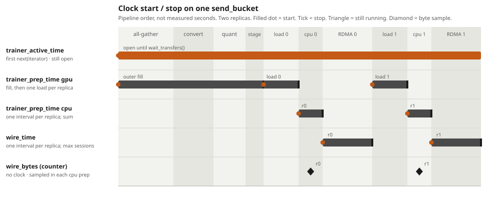
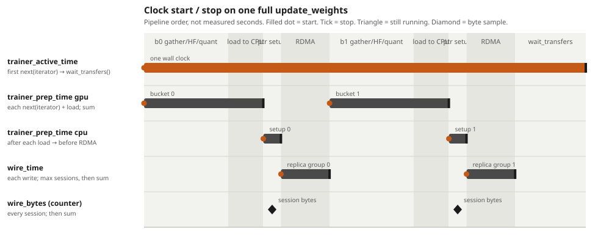

# P2P NIXL perf metrics

On every NIXL P2P weight transfer, collect these metrics and append them to
`p2p_nixl_perf.log` in the trainer working directory. No flag. Rank 0 writes
the file after gathering from sender GPUs.

One `update_weights` is one full weight transfer (all parameters). The run
calls it again on later training steps; each call is its own log section. We
do **not** add those together.

Inside one full transfer there are two loops:

- **Outer loop:** `for bucket in iter_hf_weights: send_bucket(bucket)`. One
  outer step is one `send_bucket`. All-gather + HF convert for that bucket run
  in `next(iterator)`, just before `send_bucket`.
- **Inner loop:** inside `send_bucket`, `for replica in _transfer_engine_meta_list`:
  `load_weights` then RDMA to each remote session. One GPU can have more than
  one CPU replica.

Which loop a metric uses:

- `trainer_prep_time` gpu — outer (`next(iterator)` until after staging)
  **plus** every inner `load_weights`. Sum every outer step and every load
  of this full transfer.
- `trainer_prep_time` cpu — host work starting on the main thread right
  after `load_weights`, until just before the RDMA write. Then sum across
  inner **and** outer so the logged number is the full transfer.
- `max_num_wire_bytes_per_trainer`, `wire_time` — inner (replica / session).
  Then sum across inner **and** outer so the logged number is the full
  transfer.
- `trainer_active_time` — the whole `update_weights` send path, not a sum of
  either loop.

---

## max_num_wire_bytes_per_trainer

**What it measures:** How many bytes each trainer GPU sends on the wire in this
full transfer.

**How we measure it:** Inner: in `_do_p2p_write_one_session`, sum `source_lens`
(CPU replica shard, `numel * element_size`, once per remote session). That is
the RDMA payload. Sum every inner write on that GPU, over every outer
`send_bucket`.

**What you see in the log:** Which GPU sent the most, and how many bytes.

Bytes print as decimal **GB** (10^9), not GiB (2^30), so this line divided by
`wire_time` is directly comparable to a NIC line rate without a base change.
Note the surrounding `memory_utils` lines (`total_GB`, `free_GB`) are binary
values carrying a `GB` label, so the two are not the same unit despite the
matching suffix.

---

## wire_time

**What it measures:** Time the trainer spent in RDMA: from the CPU starting
the NIXL write until it returns.

**How we measure it:** Inner: timer around `_do_nixl_write` (start right before,
stop when it returns).

One replica can RDMA the same buffer to several targets in parallel (one
session per engine). Count that group **once**: take the longest session
time, not the sum. Then sum across CPU replicas on this GPU (they run one
after the other on the shared buffer) and across every outer `send_bucket`.

**What you see in the log:** The GPU with the largest work.

---

## trainer_prep_time

Two parts, still measured separately per GPU. The log has **three** numbers,
each with the GPU that owns that max (they can be three different GPUs):

- max `gpu_prep`
- max `cpu_prep`
- max `gpu_prep + cpu_prep` on the **same** GPU (do not add the two category
  maxes from different GPUs)

### 1. gpu

**What it measures:** All-gather + HF convert + quant + staging, and the copy
of that bucket into the pinned CPU replica.

**How we measure it:** Outer clock: start at `next(iterator)`, stop at
`stop_gpu_prep()` after staging, right before `load_weights`. Then add each
`load_weights`. Sum every outer step and every load of this full transfer,
per GPU. RDMA between replicas is not in this sum.

**gpu_prep parts.** Gather, convert, and stage are extra counters inside that
outer clock. `cpu_load` is the `load_weights` time added into `gpu_prep`.
Each sender GPU **sums** that part over this full transfer. Rank 0 does **not**
pick a max GPU per part. It prints the numbers from the same GPU as
`trainer_prep_time_total` (`argmax(gpu_prep + cpu_prep)` on one GPU). They
need not add up to that GPU's `gpu_prep` (packing, tqdm, checksums stay in
the residual).

- **gather** — start before `_materialize_non_expert_batch` /
  `_materialize_expert_batch` (raw) or each `next()` of
  `export_hf_weights` (bridge); stop when that call returns.
  Raw path also prints load / PP / TP / EP chunks **inside** that wall clock,
  from the same total GPU (not independent argmax). They need not add up to
  `gather` (`_set_tp_attrs` stays in the residual). Bridge has no inner
  hooks (`export_hf_weights` is one `next()`), so those inner lines are
  `0.00s`.
  - **gather_load** — `_load_or_allocate_params`: copy this rank's shards
    onto the GPU (or allocate receive buffers) and `cuda.synchronize`.
  - **gather_pp** — `_broadcast_across_pp` when PP is gathered; skipped
    (stays `0.00s`) when `gather_pp` is false.
  - **gather_tp** — `all_gather_params_async`: TP all-gather (dense) or
    ETP all-gather (routed experts). Also prints three sequential chunks
    **inside** that call, from the same total GPU. They need not add up
    to `gather_tp`.
    - **gather_tp_start** — allocate receive buffers and launch
      `dist.all_gather(..., async_op=True)` for every param.
    - **gather_tp_wait** — wait those NCCL handles (overlap is inside
      this wait, not across other gather steps).
    - **gather_tp_concat** — concat partitions and GLU / MoE rechunk.
  - **gather_ep** — `dist.all_gather_object` (EP names) plus each EP
    `dist.all_gather` and the wait of those handles. Near-zero when
    `ep.size == 1`.
  Bridge: AutoBridge `export_hf_weights` (TP/EP collectives and its HF
  convert live in that `next()`).
- **convert** — start before `convert_to_hf` (raw) or the body of
  `_postprocess_and_quantize` (bridge); stop when it returns.
  Includes: vocab unpad of embeddings / `lm_head`; HF layout (rename,
  split fused QKV, split SwiGLU gate/up); `quantize_params` to the
  rollout dtype (FP8 / MXFP8 / NVFP4 / compressed-tensors) or a no-op
  when there is no quant config. Not `load_weights`.
- **stage** — start before `_get_transfer_ready_params`; stop when it
  returns (still before `load_weights`).
  Includes: map HF names to sglang names; hold Q/K/V or expert shards in
  `_staged_tensors` until the fused sglang param is complete; return the
  tensors that are ready to load. Not the CPU `load_weights` copy.
- **cpu_load** — each `load_weights`: copy ready HF tensors into the shared
  pinned CPU replica. Replicas on one GPU run one after another, so **sum**
  them, then sum every outer `send_bucket`. This is the load-to-CPU slice of
  `gpu_prep`. Not pointer setup and not the RDMA write.

### 2. cpu

**What it measures:** Host work after the CPU load, until the moment before
the RDMA write. That is opening the wire group, submitting the session,
waiting for a pool thread, and pointer setup.

**How we measure it:** One `time.monotonic()` start on the main thread
immediately after `load_weights` returns, before `begin_wire_group`. Each
session of that replica stops right before `_do_nixl_write`. Sessions share
that start and can run in parallel: count the group **once** (longest stop),
like `wire_time`. Then sum every replica and every outer `send_bucket`.
`load_weights` is gpu-prep, not this number.

**What you see in the log:** Three lines: GPU with max gpu-prep, GPU with max
cpu-prep, GPU with max `gpu_prep + cpu_prep` (same GPU). Then that last
GPU's gather / convert / stage / cpu_load split. Gather also prints load /
PP / TP / EP from that same GPU, and TP also prints start / wait / concat.

---

## trainer_active_time

**What it measures:** Wall clock of this full transfer: first all-gather until
every write is finished. Not a sum of outer `send_bucket` times and not a sum
of inner replica times (those overlap).

**How we measure it:** Start at the first `next(iterator)` of this
`update_weights`. Stop after `wait_transfers()` in `after_base_weights`.

**What you see in the log:** The GPU with the largest active time.

---

## How to implement

New file `miles/backends/training_utils/weight_update/protocols/p2p_nixl_perf.py`.
On whenever `--update-weight-transfer-backend nixl`. No flag.

There is no lock on the RDMA path today, and we do not add one for metrics.
`P2PTransferManager` runs each session in a thread pool, so several
`_do_nixl_write` calls can finish at once. Time the write **inside that
call**, return `(bytes, duration)` on the future, and fold max/sum on the
**main thread** after `f.result()` / `wait_transfers()`. The clock is just
`time.monotonic()` around `_do_nixl_write`; the fold is not on the RDMA
critical path.

Identity: local GPU = gloo `global_rank` (log as `gpu=`). Also store `pp_rank`
and `gathered_dp_rank` on the payload. Reset counters at the start of each
`update_weights` send path.

Every sender rank measures itself. Rank 0 only **gathers and writes the
file** so one shared log is not appended by many processes at once.
Non-senders send `None`. Rank 0 prints the bottleneck GPU per metric (max
bytes, max wire_time, max gpu_prep, max cpu_prep, max gpu+cpu on one GPU,
max active). That is the trainer-side P2P path, not rollout
`post_load_weights`. Because all-gather is lockstep and `update_weights`
ends on a gloo barrier, the max `trainer_active_time` is the stall the
system waits on.

Aggregation (full transfer = one log section):

| Metric | Per event | Fold parallel sessions | Fold sequential replicas | Fold outer `send_bucket` | Log |
|---|---|---|---|---|---|
| `max_num_wire_bytes_per_trainer` | `sum(source_lens)` in `_do_p2p_write_one_session` | **sum** (every session) | sum | sum | GPU with max bytes |
| `wire_time` | timer around `_do_nixl_write` | **max** (count once) | sum | sum | GPU with max work |
| `trainer_prep_time` gpu | `next(iterator)` until after staging, plus each `load_weights` | n/a (outer, main thread) | **sum** loads | sum | GPU with max gpu_prep |
| `trainer_prep_time` gpu gather | `_materialize_*` / bridge `export_hf_weights` `next()` | n/a | n/a | sum | that GPU's gather |
| `trainer_prep_time` gpu gather_load | `_load_or_allocate_params` | n/a | n/a | sum | that GPU's load |
| `trainer_prep_time` gpu gather_pp | `_broadcast_across_pp` | n/a | n/a | sum | that GPU's PP |
| `trainer_prep_time` gpu gather_tp | `all_gather_params_async` (TP or ETP) | n/a | n/a | sum | that GPU's TP |
| `trainer_prep_time` gpu gather_tp_start | launch `dist.all_gather` | n/a | n/a | sum | that GPU's TP start |
| `trainer_prep_time` gpu gather_tp_wait | wait NCCL handles | n/a | n/a | sum | that GPU's TP wait |
| `trainer_prep_time` gpu gather_tp_concat | concat / GLU rechunk | n/a | n/a | sum | that GPU's TP concat |
| `trainer_prep_time` gpu gather_ep | EP `all_gather_object` + `all_gather` + wait | n/a | n/a | sum | that GPU's EP |
| `trainer_prep_time` gpu convert | `convert_to_hf` / `_postprocess_and_quantize` | n/a | n/a | sum | that GPU's convert |
| `trainer_prep_time` gpu stage | `_get_transfer_ready_params` | n/a | n/a | sum | that GPU's stage |
| `trainer_prep_time` gpu cpu_load | `load_weights` | n/a | **sum** | sum | that GPU's cpu_load |
| `trainer_prep_time` cpu | after `load_weights` until before `_do_nixl_write` | **max** | sum | sum | GPU with max cpu_prep |
| `trainer_active_time` | first `next(iterator)` → `wait_transfers()` done | n/a | n/a | n/a (one wall clock) | GPU with max active |

Each sender payload carries that rank’s `gpu_prep`, `cpu_prep`, `gpu_gather`,
`gpu_gather_load`, `gpu_gather_pp`, `gpu_gather_tp`, `gpu_gather_tp_start`,
`gpu_gather_tp_wait`, `gpu_gather_tp_concat`, `gpu_gather_ep`,
`gpu_convert`, `gpu_stage`, and `gpu_cpu_load`. Rank 0 prints three prep picks:

- `argmax(gpu_prep)`
- `argmax(cpu_prep)`
- `argmax(gpu_prep + cpu_prep)` on **that same GPU**, then **that GPU's**
  gather / convert / stage / cpu_load (and gather's load / PP / TP / EP,
  and TP's start / wait / concat)

Do not define the third number as `max(gpu_prep) + max(cpu_prep)` across
different GPUs. Do not `argmax` gather, convert, stage, cpu_load, or gather
chunks on their own.

Hook sites:

- `updater.py` `update_weights`: start `trainer_active_time`; time each
  `next(iterator)` as prep gpu; protocol exposes the collector (updater does
  not import NIXL).
- iterator: time `_materialize_*` as gather, `convert_to_hf` as convert
  (bridge: `export_hf_weights` `next()` as gather,
  `_postprocess_and_quantize` as convert). Raw `_materialize_*` also times
  `_load_or_allocate_params`, `_broadcast_across_pp`,
  `all_gather_params_async` (and its start / wait / concat), and EP
  `all_gather_object` / `all_gather` / wait.
- `p2p.py` `send_bucket`: time `_get_transfer_ready_params` as stage; time
  `load_weights` per replica as gpu-prep `cpu_load` (added into `gpu_prep`);
  start the cpu-prep clock immediately after that `load_weights`.
- `p2p.py` `_do_p2p_write_one_session`: add bytes; stop cpu-prep right before
  `_do_nixl_write`; group sessions of one replica so wire_time / cpu-setup
  use max, not sum.
- `p2p.py` `_do_nixl_write`: start/stop for wire_time.
- `p2p.py` `after_base_weights`: `wait_transfers()`, stop active time,
  `gather_object` on gloo, rank 0 appends to `p2p_nixl_perf.log`.

Log (rank 0, append, one section per `weight_version`):

```text
=== p2p nixl perf  weight_version=12 ===
max_num_wire_bytes_per_trainer: gpu=5 bytes=13.31GB
wire_time: gpu=5 work=2.110s
trainer_prep_time_gpu: gpu=5 time=0.91s
trainer_prep_time_cpu: gpu=2 time=0.55s
trainer_prep_time_total: gpu=5 gpu_prep=0.91s cpu_prep=0.40s total=1.31s
trainer_prep_time_gpu_gather: gpu=5 time=0.50s
trainer_prep_time_gpu_gather_load: gpu=5 time=0.04s
trainer_prep_time_gpu_gather_pp: gpu=5 time=0.00s
trainer_prep_time_gpu_gather_tp: gpu=5 time=0.41s
trainer_prep_time_gpu_gather_tp_start: gpu=5 time=0.02s
trainer_prep_time_gpu_gather_tp_wait: gpu=5 time=0.35s
trainer_prep_time_gpu_gather_tp_concat: gpu=5 time=0.04s
trainer_prep_time_gpu_gather_ep: gpu=5 time=0.04s
trainer_prep_time_gpu_convert: gpu=5 time=0.30s
trainer_prep_time_gpu_stage: gpu=5 time=0.01s
trainer_prep_time_gpu_cpu_load: gpu=5 time=0.15s
trainer_active_time: gpu=5 time=3.410s
```

---

## Clock start and stop

X-axis is pipeline order, not measured seconds. A bar is one
`time.monotonic()` interval. `max_num_wire_bytes_per_trainer` is not a
clock; it is sampled during pointer setup (`sum(source_lens)`).

### One `send_bucket`

Pipeline on this plot: all-gather, HF convert, quant, staging, then one
iteration per CPU replica: `load_weights`, cpu-prep, `_do_nixl_write`. The
figure draws two replicas. A GPU with more replicas repeats that triple.



`trainer_active_time` starts at the first `next(iterator)` of this
`update_weights` and does **not** stop at the end of this bucket.

`trainer_prep_time` gpu starts at that `next(iterator)` (all-gather + HF
convert + quant run inside the yield). The outer clock stops at
`stop_gpu_prep()`, after staging. Each replica's `load_weights` is its own
bar on that row and is added into the same gpu total. The `cpu_load` line
in the log is the sum of those copies.

`trainer_prep_time` cpu is one bar per replica. It starts on the main
thread immediately after that replica's `load_weights` returns, before
`begin_wire_group`. The bar includes opening the wire group, submitting the
session, pool scheduling, and pointer setup (walk names, collect CPU and
remote pointers, `add_wire_bytes`). Not a tensor copy. Each session stops
immediately before `_do_nixl_write`. Parallel sessions of one replica share
that one start; the replica keeps the longest. The next replica starts a
new cpu-prep bar after the previous replica's RDMA.

`wire_time` is one bar per replica. It starts immediately before
`_do_nixl_write` and stops when that call returns (including the DONE poll).
Parallel sessions of one replica keep the longest write, not the sum.

### One full `update_weights`

Two outer `send_bucket` steps, then `wait_transfers()`. After each fill the
figure draws two replicas: load, cpu-prep, and `wire_time`, then the same
triple again. A non-last replica finishes RDMA before the next replica loads.
The log **sums** those bars. `trainer_active_time` is one wall clock around
them, including the gaps.



On this plot, each **load** is one replica's `load_weights` and is part of
gpu-prep (`cpu_load`). Each **cpu** bar is that replica's
`trainer_prep_time` cpu. Each **RDMA** bar is that replica's `wire_time`.

`trainer_active_time` starts at the first `next(iterator)` and stops in
`after_base_weights` after `wait_transfers()`. Last-replica writes can still
be in flight until that wait.

Parallel sessions of one replica share the cpu-prep start taken right after
`load_weights` and each stop before their own `_do_nixl_write`. Each session
still has its own `wire_time` clock. The replica keeps the longest of each,
not the sum.

